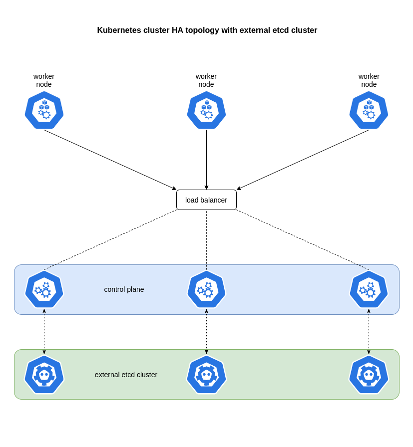

# How to set up highly available K8s cluster using kubeadm

This tutorial will guide you through creation of a highly available kubernetes cluster using official tool &mdash; `kubeadm`. KVM virtual machines will be used as k8s nodes and a load balancer. It is totally fine to use any other hypervisor: VmWare, Hyper-V etc. Any cloud provider will also do well. Everything should be compatible.

## Prerequisites

There will be 10 virtual machines in total: 3 etcd nodes, 3 controller-manager nodes, 3 worker nodes and 1 load balancer.

There will be only one network for every kubernetes service &mdash; `10.1.1.0/24`. It is possible to make separate network for the internal services of the cluster, but for learning and testing purposes one network is enough.

You can pick any Linux-based operating system e.g. `Debian 11` or `CentOS 8`. In this tutorial I am using `Debian 11` virtual machines.

### Control plane nodes

`m1` &mdash; 10.1.1.99

`m2` &mdash; 10.1.1.98

`m3` &mdash; 10.1.1.97

Each control plane node requires 2 CPU cores and 2Gb of memory. 10Gb disk is totally fine.

### Worker nodes

`n1` &mdash; 10.1.1.96

`n2` &mdash; 10.1.1.95

`n3` &mdash; 10.1.1.94

Each worker node requires at least 2 CPU cores and 2Gb of memory. The higher the workload the more resources nodes need. Used disk space mostly depends on the number of containers pulled to local storage. 10Gb disk will do fine to start with.

### Etcd nodes

`e1` &mdash; 10.1.1.93

`e2` &mdash; 10.1.1.92

`e3` &mdash; 10.1.1.91

Each etcd node requires 1 CPU core and 1Gb of memory. Used disk space depends on the amount of data in key-value storage. 5Gb disk should be enough for learning and testing purposes.

### Load balancer

`lb` &mdash; 10.1.1.90

Load balancer requires 1 CPU and 1Gb of memory. Disk only requires space for `haproxy` to be installed, so 2Gb or even less (depending on the OS) will do well.

Complete cluster should look like this:

## Provisioning software

Since virtual machines can be easily grouped by their role in the cluster I prefer to use `Ansible` to provision required software, but any other configuration management system will do. Manual installation is also ok, but time-consuming.

Common packages for every k8s node (incl. etcd nodes):

* curl
* wget
* dnsutils
* gnupg
* openssl
* ca-certificates
* net-tools
* apt-transport-https
* lsb-release
* apparmor

Tools for every k8s node:

* containerd
* kubeadm
* kubelet
* kubectl (one kubectl installation on first controller-manager node is enough)

Tools for etcd nodes:

* kubeadm
* etcd

Tools for load balancer:

* haproxy

## Setup order

1. [etcd setup](docs/01_etcd_setup.md)
2. [load balancer setup](docs/02_load_balancer_setup.md)
3. [bootstrapping the first control plane node](docs/03_first_control_plane.md)
4. [joining the rest of the control plane nodes](docs/04_control_plane.md)
5. [joining the worker nodes](docs/05_joining_workers.md)